# DDD Go Event Management System

A Domain-Driven Design implementation in Go for managing sporting events, entries, and participants.

## Domain Model

The system follows DDD principles with clear aggregate boundaries and relationships:

```plantuml
@startuml Domain Model

!define AGGREGATE_BOUNDARY_COLOR #FF6B6B
!define ENTITY_COLOR #4ECDC4
!define VALUE_OBJECT_COLOR #45B7D1
!define REFERENCE_COLOR #96CEB4

package "Person Aggregate" AGGREGATE_BOUNDARY_COLOR {
  class Person ENTITY_COLOR {
    +ID: UUID
    +Name: string
    +Email: string
    +Phone: string
    +EntryIDs: []UUID
    +CreatedAt: Time
    +UpdatedAt: Time
    +ArchivedAt: *Time
  }
}

package "EventSeries Aggregate" AGGREGATE_BOUNDARY_COLOR {
  class EventSeries ENTITY_COLOR {
    +ID: UUID
    +Name: string
    +Description: string
    +Events: []Event
    +OrganiserID: UUID
    +CreatedAt: Time
    +UpdatedAt: Time
    +ArchivedAt: *Time
  }
  
  class Event ENTITY_COLOR {
    +ID: UUID
    +Name: string
    +Date: Time
    +Distances: []Distance
    +Entries: []Entry
    +OrganiserID: UUID
    +CreatedAt: Time
    +UpdatedAt: Time
    +ArchivedAt: *Time
  }
  
  class Distance ENTITY_COLOR {
    +ID: UUID
    +Name: string
    +Length: float64
    +EventID: UUID
    +Medals: []Medal
    +CreatedAt: Time
    +UpdatedAt: Time
    +ArchivedAt: *Time
  }
  
  class Medal ENTITY_COLOR {
    +ID: UUID
    +Name: string
    +Description: string
    +DistanceID: UUID
    +EntryID: UUID
    +CreatedAt: Time
    +UpdatedAt: Time
    +ArchivedAt: *Time
  }
  
  class Entry ENTITY_COLOR {
    +ID: UUID
    +DistanceID: UUID
    +EntrantID: UUID
    +EventID: UUID
    +CreatedAt: Time
    +UpdatedAt: Time
    +ArchivedAt: *Time
  }
  
  class Entrant ENTITY_COLOR {
    +ID: UUID
    +PersonID: UUID
    +EventID: UUID
    +CreatedAt: Time
    +UpdatedAt: Time
    +ArchivedAt: *Time
  }
}

package "Organiser Aggregate" AGGREGATE_BOUNDARY_COLOR {
  class Organiser ENTITY_COLOR {
    +PersonID: UUID
    +EventIDs: []UUID
    +CreatedAt: Time
    +UpdatedAt: Time
    +ArchivedAt: *Time
  }
}

package "Value Objects" VALUE_OBJECT_COLOR {
  class Transaction {
    -from: UUID
    -to: UUID
    -createdAt: Time
  }
  
  class EntrantStatus {
    +registered
    +confirmed
    +started
    +finished
    +dnf
    +dq
  }
  
  class DistanceValue {
    +Value: float64
    +Unit: string
  }
  
  class Duration {
    +Hours: int
    +Minutes: int
    +Seconds: int
  }
}

' Aggregate Internal Relationships
EventSeries ||--o{ Event : contains
Event ||--o{ Distance : contains
Event ||--o{ Entry : contains
Distance ||--o{ Medal : contains

' Cross-Aggregate References (by ID only)
Entry }o--|| Entrant : references
Entrant }o--|| Person : references
Event }o--|| Organiser : references
Medal }o--|| Entry : references

' Aggregate Boundaries
note top of Person : "Person Aggregate\n- Root: Person\n- Manages personal data"
note top of EventSeries : "EventSeries Aggregate\n- Root: EventSeries\n- Manages events, distances,\n  entries, and medals"
note top of Organiser : "Organiser Aggregate\n- Root: Organiser\n- Manages event organization"

@enduml
```

## Key Relationships

### Domain Flow
1. **Person** creates an **Entry** for a specific **Distance** within an **Event**
2. **Entrant** is created to associate the **Person** with the **Event**
3. **Entry** links to both **Distance** and **Entrant**
4. **Medal** is awarded to winning **Entry** for each **Distance**

### Aggregate Boundaries
- **Person Aggregate**: Manages individual participant data
- **EventSeries Aggregate**: Central aggregate containing events, distances, entries, and medals
- **Organiser Aggregate**: Manages event organization responsibilities

### Cross-Aggregate References
- All references between aggregates use IDs only (no direct object embedding)
- Maintains loose coupling between bounded contexts
- Enables independent evolution of each aggregate

## Architecture

- `entity/` - Domain entities with identity
- `valueobject/` - Value objects without identity
- `aggregates/` - Aggregate roots and boundaries (planned)
- `domain/` - Domain services (planned)